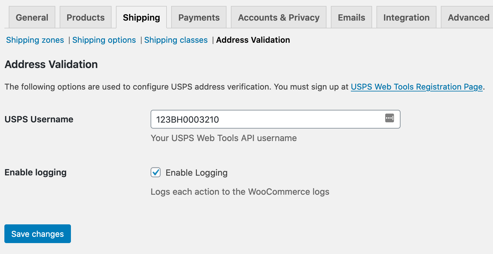
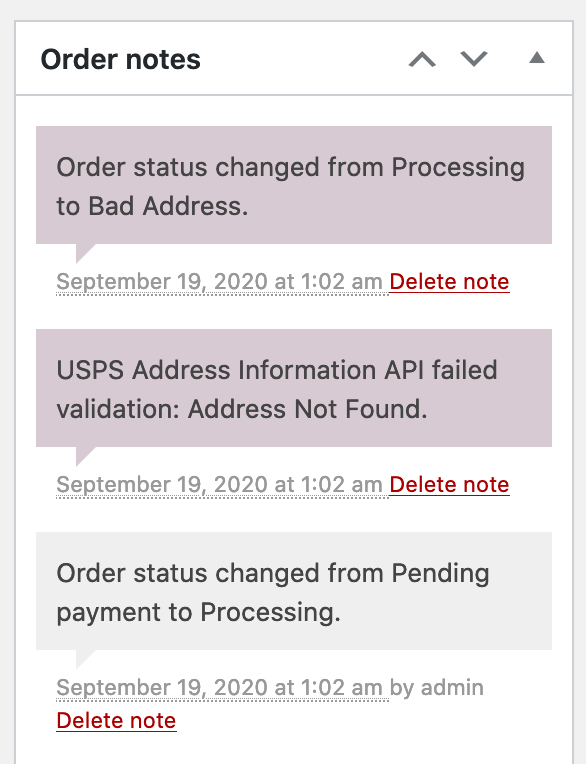
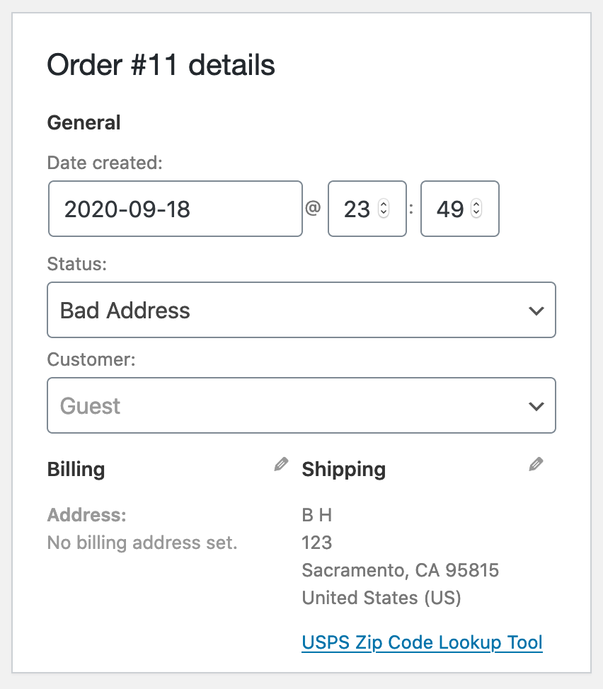
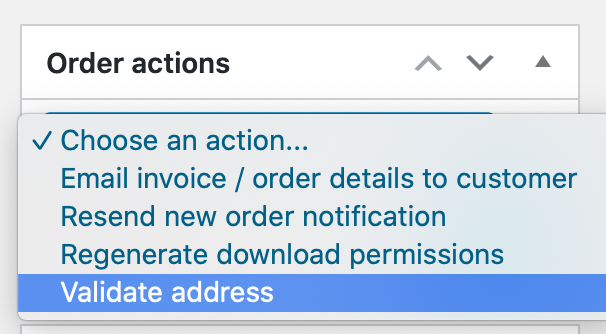

[](#) [](https://brianhenryie.github.io/bh-wc-address-validation/)

# BH WC Address Validation

Uses USPS API to validate and update addresses when an order is marked processing.

* Only changes the address once when run automatically
* Can be run manually repeatedly
* Sets order status to on-hold when deactivated
* Checks on-hold orders for plugin meta-key when activated to re-set orders to bad-address status
* Optionally triggers an email to admin when an order needs attention

TODO: Verify orders with bad-address status are correctly accounted for in reports. 










## Develop

Add a `.env.secret` file in the root of the project containing your USPS username.

```
USPS_USERNAME="123BH0003210"
```


For integration and acceptance tests, a local webserver must be running with `localhost:8080/bh-wc-checkout-rate-limiter/` pointing at the root of the repo. MySQL must also be running locally – with two databases set up with:

```
mysql_username="root"
mysql_password="secret"

# export PATH=${PATH}:/usr/local/mysql/bin

# Make .env available 
# To bash:
# export $(grep -v '^#' .env.testing | xargs)
# To zsh:
# source .env.testing

# Create the database user:
# MySQL
# mysql -u $mysql_username -p$mysql_password -e "CREATE USER '"$TEST_DB_USER"'@'%' IDENTIFIED WITH mysql_native_password BY '"$TEST_DB_PASSWORD"';";
# or MariaDB
# mysql -u $mysql_username -p$mysql_password -e "CREATE USER '"$TEST_DB_USER"'@'%' IDENTIFIED BY '"$TEST_DB_PASSWORD"';";

# Create the databases:
mysql -u $mysql_username -p$mysql_password -e "CREATE DATABASE "$TEST_SITE_DB_NAME"; USE "$TEST_SITE_DB_NAME"; GRANT ALL PRIVILEGES ON "$TEST_SITE_DB_NAME".* TO '"$TEST_DB_USER"'@'%';";
mysql -u $mysql_username -p$mysql_password -e "CREATE DATABASE "$TEST_DB_NAME"; USE "$TEST_DB_NAME"; GRANT ALL PRIVILEGES ON "$TEST_DB_NAME".* TO '"$TEST_DB_USER"'@'%';";
```


### WordPress Coding Standards

See documentation on [WordPress.org](https://make.wordpress.org/core/handbook/best-practices/coding-standards/) and [GitHub.com](https://github.com/WordPress/WordPress-Coding-Standards).

Correct errors where possible and list the remaining with:

```
vendor/bin/phpcbf; vendor/bin/phpcs
```

### Tests

Tests use the [Codeception](https://codeception.com/) add-on [WP-Browser](https://github.com/lucatume/wp-browser) and include vanilla PHPUnit tests with [WP_Mock](https://github.com/10up/wp_mock).

Run tests with:

```
vendor/bin/codecept run unit;
vendor/bin/codecept run wpunit;
vendor/bin/codecept run integration;
vendor/bin/codecept run acceptance;
```

Show code coverage (unit+wpunit):

```
XDEBUG_MODE=coverage composer run-script coverage-tests 
```

Static analysis:

```
vendor/bin/phpstan analyse --memory-limit 1G
```

To save changes made to the acceptance database:

```
export $(grep -v '^#' .env.testing | xargs)
mysqldump -u $TEST_SITE_DB_USER -p$TEST_SITE_DB_PASSWORD $TEST_SITE_DB_NAME > tests/_data/dump.sql
```

To clear Codeception cache after moving/removing test files:

```
vendor/bin/codecept clean
```